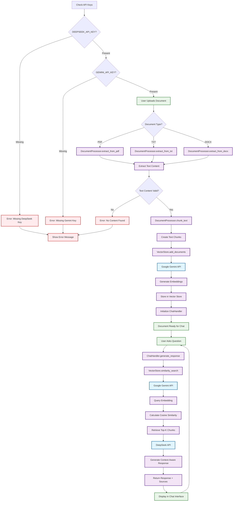
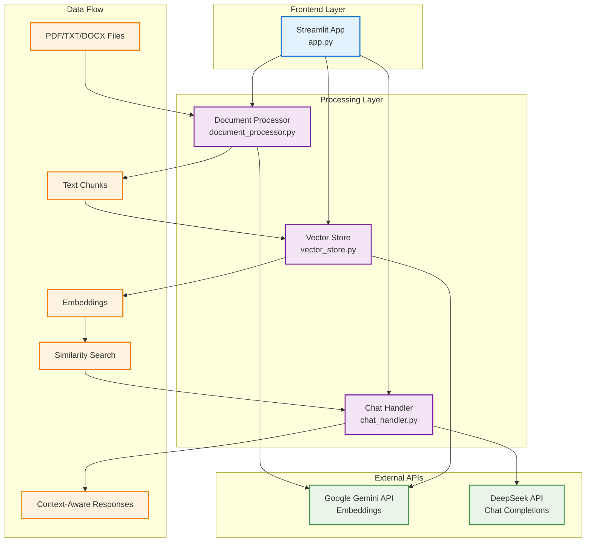

# RAG Document Chatbot - Local Setup Guide

A Streamlit-based RAG (Retrieval-Augmented Generation) chatbot that allows you to upload documents and have intelligent conversations about their content using DeepSeek AI and Google Gemini embeddings.


## Features

- Support for PDF, TXT, and DOCX documents
- Google Gemini embeddings for accurate document understanding
- DeepSeek AI for intelligent, cost-effective responses
- Context-aware responses with source citations
- Clean, intuitive web interface

## Prerequisites

- Python 3.8 or higher
- DeepSeek API key (get from: https://platform.deepseek.com)
- Google Gemini API key (get from: https://ai.google.dev)

## Local Installation

### 1. Extract and Navigate
```bash
# Extract the downloaded zip file
unzip rag-chatbot.zip
cd rag-chatbot
```

### 2. Create Virtual Environment (Recommended)
```bash
# Create virtual environment
python -m venv venv

# Activate virtual environment
# On Windows:
venv\Scripts\activate
# On macOS/Linux:
source venv/bin/activate
```

### 3. Install Dependencies

**If you have Python 3.10+:**
```bash
pip install -r local_requirements.txt
```

**If you have Python 3.8-3.9 or encounter version conflicts:**
```bash
pip install -r local_requirements_minimal.txt
```

**If you still have issues, install one by one:**
```bash
pip install streamlit
pip install google-generativeai
pip install openai
pip install numpy
pip install PyPDF2
pip install python-docx
```

### 4. Set Environment Variables

**Option A: Create .env file (Recommended)**
Create a file named `.env` in the project root:
```
DEEPSEEK_API_KEY=your_deepseek_api_key_here
GEMINI_API_KEY=your_gemini_api_key_here
```

**Option B: Set environment variables directly**

On Windows (Command Prompt):
```cmd
set DEEPSEEK_API_KEY=your_deepseek_api_key_here
set GEMINI_API_KEY=your_gemini_api_key_here
```

On Windows (PowerShell):
```powershell
$env:DEEPSEEK_API_KEY="your_deepseek_api_key_here"
$env:GEMINI_API_KEY="your_gemini_api_key_here"
```

On macOS/Linux:
```bash
export DEEPSEEK_API_KEY="your_deepseek_api_key_here"
export GEMINI_API_KEY="your_gemini_api_key_here"
```

### 5. Run the Application

**Method 1 - Direct streamlit command:**
```bash
streamlit run app.py
```

**Method 2 - If "streamlit" command not found:**
```bash
python -m streamlit run app.py
```

**Method 3 - Use the helper script:**
```bash
python run_local.py
```

The application will open in your default web browser at `http://localhost:8501`

## Railway Deployment

You can also deploy this application to Railway for easy cloud hosting:

[

### Railway Deployment Steps:

1. **Fork this repository** to your GitHub account
2. **Click the Railway deploy button** above or visit [Railway](https://railway.app)
3. **Connect your GitHub account** and select this repository
4. **Set environment variables** in Railway dashboard:
   - `DEEPSEEK_API_KEY`: Your DeepSeek API key
   - `GEMINI_API_KEY`: Your Google Gemini API key
5. **Deploy** - Railway will automatically build and deploy your application
6. **Access your app** at the provided Railway URL

### Railway Environment Variables:
Make sure to set these in your Railway project settings:
```
DEEPSEEK_API_KEY=your_deepseek_api_key_here
GEMINI_API_KEY=your_gemini_api_key_here
```

## Application Architecture



## System Components



## How to Use

1. **Upload Document**: Use the sidebar to upload a PDF, TXT, or DOCX file
2. **Process Document**: Click "Process Document" to analyze and index the content
3. **Start Chatting**: Ask questions about your document in the chat interface
4. **View Sources**: Expand the source sections to see which parts of the document were used for each response

## API Keys Setup

### DeepSeek API Key
1. Go to https://platform.deepseek.com
2. Sign up for an account
3. Navigate to API Keys section
4. Generate a new API key
5. Copy the key for use in your environment variables

### Google Gemini API Key
1. Go to https://ai.google.dev
2. Sign in with your Google account
3. Navigate to "Get API Key" 
4. Create a new project or select existing one
5. Generate API key for Gemini API
6. Copy the key for use in your environment variables

## Troubleshooting

### Common Issues

**"Module not found" errors:**
- Ensure you've activated your virtual environment
- Run `pip install -r local_requirements.txt` again

**"API key not found" errors:**
- Double-check your environment variables are set correctly
- Restart your terminal/command prompt after setting environment variables
- Verify API keys are valid and have sufficient credits

**Document processing fails:**
- Ensure uploaded file is not corrupted
- Check file size (very large files may cause memory issues)
- Try a different document format

**Network/API errors:**
- Check your internet connection
- Verify API keys haven't expired
- Check API service status

## Project Structure

```
rag-chatbot/
├── app.py                 # Main Streamlit application
├── document_processor.py  # Document text extraction and chunking
├── vector_store.py        # Google Gemini embeddings and similarity search
├── chat_handler.py        # DeepSeek AI chat response generation
├── local_requirements.txt # Python dependencies
├── README.md             # This setup guide
└── .streamlit/
    └── config.toml       # Streamlit configuration
```

## Performance Tips

- For large documents, processing may take a few minutes
- The first query after uploading a document may be slower as embeddings are generated
- Subsequent queries will be much faster
- Consider breaking very large documents into smaller sections

## Cost Information

- **Google Gemini**: Free tier with generous limits for embeddings
- **DeepSeek**: Very cost-effective pricing, typically under $0.01 per conversation

## Support

If you encounter any issues:
1. Check the troubleshooting section above
2. Verify all dependencies are correctly installed
3. Ensure API keys are valid and properly set
4. Check the terminal/command prompt for detailed error messages
